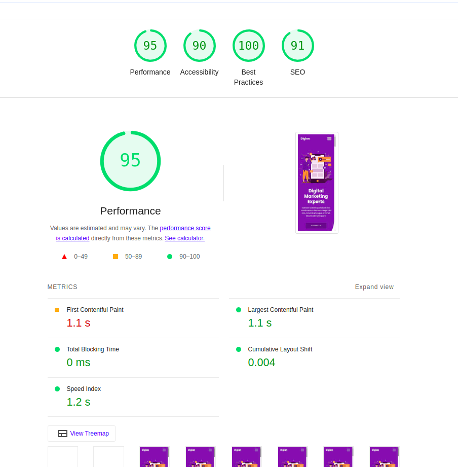

# hw2

以上為待修正內容

優化內容總結
預加載資源：
使用 <link rel="preconnect"> 和 <link rel="preload"> 預加載字體、CSS 和圖片。
圖片優化：
使用 WebP 格式作為首選，並提供 PNG 作為回退。
添加 width 和 height 屬性以避免佈局偏移。
啟用 loading="lazy" 延遲加載非關鍵圖片。
壓縮 CSS 和 JavaScript：
使用 style.min.css 和 bootstrap.min.css。
壓縮自定義 JavaScript 為 custom.min.js。
內聯關鍵 CSS：
將關鍵的 CSS 直接內聯到 <head> 中。
緩存靜態資源：
在伺服器配置中啟用緩存策略（如 Apache 的 mod_expires）。
避免鏈式請求：
預加載關鍵資源以減少鏈式請求。
確保文字在字體加載期間可見：
使用 font-display: swap 確保文字在字體加載期間仍然可見。

